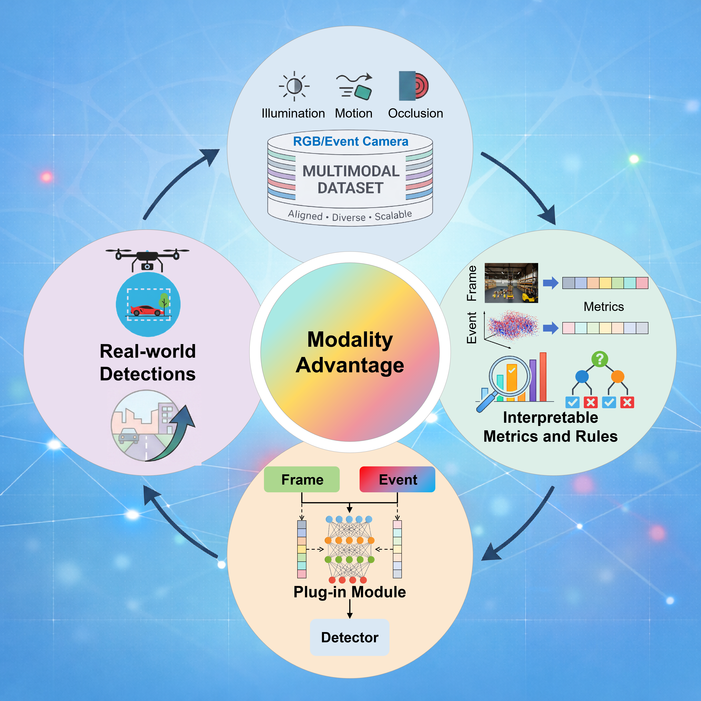

# YOLOFuse-events

This repository contains the official code for our paper:

**Understanding and Exploiting Fundamental Modality Advantage in Frame and Event Hybrid Visual Data**

<p align="center">
  
</p>

This repository contains our multimodal object detection codebase built on top of [YOLOFuse](https://github.com/WangQvQ/YOLOFuse), which itself is based on the [Ultralytics YOLO](https://github.com/ultralytics/ultralytics) framework. Our implementation extends YOLOFuse for aligned RGB-event object detection and related experiments, and includes the metric-guided plug-in module, single-modality and multimodal training pipelines.

The system requirements are listed in the **pyproject.toml**. 

Typical installation takes approximately 1 minute on a standard desktop computer.

Training (Toy Dataset): Approximately 5 minutes on a standard desktop.
## Installation

Clone the repository and install it in editable mode:

```bash
git clone git@github.com:wshs7/YOLOFuse-events.git
cd YOLOFuse-events
conda create -n yoloevents python=3.9 -y
conda activate yoloevents
pip install -e .
```

It is recommended to use a clean Python environment with the dependencies required by Ultralytics/YOLOFuse.

---

## Dataset Download

**Note: We have included a toy dataset in the project, which allows for testing without downloading the full data.**

Please download the full dataset from Google Drive:

**MAD-Drone:** https://drive.google.com/file/d/1Rw9r8QFUAiblSgn2JlC5Ajm_cFjYpz1b/view?usp=drive_link

**MAD-Drone-real:** https://drive.google.com/file/d/1r5QeH03Kx2P8Dq-i1DA9986BDFogycLz/view?usp=drive_link

After downloading, extract the dataset to your preferred location.


The multimodal dataset should follow the structure below:

```text
dataset_root/
├── images/
│   ├── train/
│   ├── val/
│   └── test/              # optional
├── imagesIR/
│   ├── train/
│   ├── val/
│   └── test/              # optional
└── labels/
    ├── train/
    ├── val/
    └── test/              # optional
```
Following the original YOLOFuse convention, `imagesIR/` is used as the folder name for the second modality. In this project, it denotes the event modality.

For the frame-only or the event-only modality,the dataset should follow the structure below:

```text
dataset_root/
├── images/                # frame modality or event modality
│   ├── train/
│   ├── val/
│   └── test/              # optional
└── labels/
    ├── train/
    ├── val/
    └── test/              # optional
```


## Training

Before running training or validation, please edit the YAML files in the `data_yaml/` directory and set the correct dataset paths.

A typical directory layout is:

```text
data_yaml/
├── frame.yaml
├── event.yaml
└── multi.yaml
```

A typical YAML file looks like this:

```yaml
path: /path/to/dataset_root
train: images/train
val: images/val
test: images/test    # optional

names:
  0: object
```

After preparing the dataset and editing the YAML file, you can start training multi-modality model with:


```bash
python train_multi.py --data data_yaml/toy_multi.yaml
python train_with_plug_in_module.py --data data_yaml/toy_multi.yaml
```

For the frame-only and event-only modaity, you can train with:

```bash
python train_frame.py --data data_yaml/toy_frame.yaml
python train_event.py --data data_yaml/toy_event.yaml
```

When the training finishes, you should see the progress logs in your terminal similar to the following:
```text
Epoch    GPU_mem   box_loss   cls_loss   dfl_loss  Instances       Size
100/100    19.9G    2.246      1.435      1.127          2        640: 
Class     Images  Instances      Box(P          R      mAP50  mAP50-95)
all        100         99      0.519      0.687      0.493      0.199
```

---

## Validation

To run validation, use (Note the path of the weights is runs/train):

```bash
python val_dual.py --data data_yaml/toy_multi.yaml --ch 5 --model /your/path/to/multi/model/pt
python val_dual.py --data data_yaml/toy_frame.yaml --ch 3 --model /your/path/to/frame/model/pt
python val_dual.py --data data_yaml/toy_event.yaml --ch 2 --model /your/path/to/event/model/pt
```

When the validation finishes, you should see the progress logs in your terminal similar to the following:

```text
Class     Images  Instances      Box      Precision     R       mAP50  
all        100         99      0.919      0.758      0.769      0.394
```

## Citation

If you use this repository in your research, please cite our work and also acknowledge YOLOFuse.

### Base framework

```bibtex
@misc{yolofuse,
  title={YOLOFuse},
  author={WangQvQ},
  howpublished={\url{https://github.com/WangQvQ/YOLOFuse}}
}
```

You may also cite the Ultralytics YOLO framework if appropriate.

---

