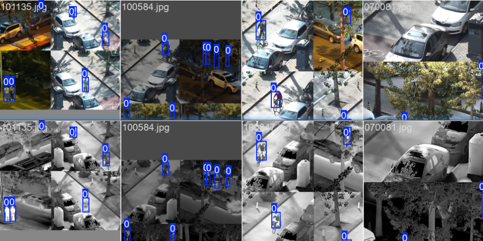
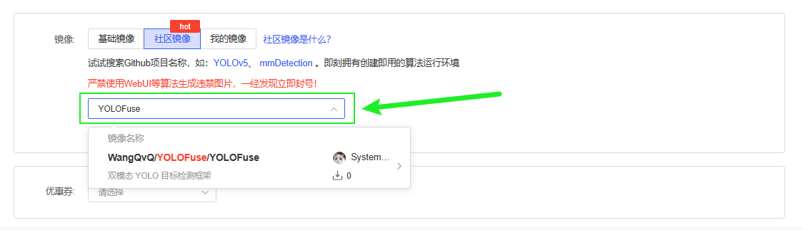

<p align="center"><a href="README.md">中文</a></p>
<p align="center">
  <a href="https://github.com/WangQvQ/YOLOFuse">
    
  </a>
  <a href="https://github.com/WangQvQ/YOLOFuse">
    
  </a>
  <a href="https://github.com/WangQvQ/YOLOFuse/blob/main/LICENSE">
    
  </a>
  <a href="https://github.com/WangQvQ/YOLOFuse">
    
  </a>
  <a href="https://www.codewithgpu.com/i/WangQvQ/YOLOFuse/YOLOFuse">
    
  </a>
</p>


# YOLOFuse: A Dual-Stream Fusion Framework for Multimodal Object Detection

<p align="center">
  
</p>

**YOLOFuse** is an enhanced object detection system built upon the [Ultralytics YOLO](https://github.com/ultralytics/ultralytics) framework, designed specifically for multimodal perception tasks. The framework introduces a dual-stream processing architecture that enables the collaborative analysis and fusion of RGB and infrared (IR) images. This significantly improves detection robustness in challenging environments such as low light, smoke, or extreme weather. YOLOFuse is well-suited for applications like surveillance, disaster rescue, and industrial inspection.

---

## ✨ Key Features

* 🚀 **Heterogeneous Data Fusion**: Supports end-to-end processing of RGB and IR images (extendable to RGB-D, etc.)
* 🔧 **YOLOv8 API Compatible**: Maintains native interface design for minimal migration effort
* 🔍 **Modular Fusion Strategies**: Offers multi-level fusion options, including:

  * ✅ Data-level Fusion
  * ✅ Decision-level Fusion
  * ✅ Early-level Feature Fusion
  * ✅ Mid-level Feature Fusion
  * ✅ Easy-level Feature Fusion
  * ✅ DEYOLO（[arxiv](https://arxiv.org/abs/2412.04931)）


---

## 📊 LLVIP Benchmark Results

| Model Architecture             | Modality | Precision (P) | Recall (R) | mAP50 | mAP50-95 | Model Size (MB) | GFLOPs |
| ------------------------------ | -------- | ------------- | ---------- | ----- | -------- | --------------- | ------ |
| yolov8n (baseline)             | RGB      | 0.888         | 0.829      | 0.891 | 0.500    | 6.2             | 8.1    |
| yolo-fuse-mid-fusion           | RGB+IR   | 0.951         | 0.881      | 0.947 | 0.601    | 2.61            | 3.2    |
| yolo-fuse-early-fusion         | RGB+IR   | 0.950         | 0.896      | 0.955 | 0.623    | 5.2             | 6.7    |
| yolo-fuse-decision-level fusion| RGB+IR   | 0.956         | 0.905      | 0.955 | 0.612    | 8.8             | 10.7   |
| YOLO-fuse-easy-fusion     | RGB+IR | 0.899  | 0.865   | 0.939   | 0.620      | 7.83      | 8.5          |
| DEYOLO             | RGB+IR | 0.943  | 0.895   | 0.952   | 0.615      | 11.85     | 16.6         |
---

## 🧩 Input Format Specification

The system automatically associates RGB and IR image pairs based on filename consistency. Please ensure matching filenames across modalities:

```
dataset_root/
├── images/        # RGB images
│   └── 120270.jpg 
└── imagesIR/      # IR images (parallel directory)
    └── 120270.jpg  # Same filename as RGB
```

> Annotation files are only required for RGB images. The system reuses them for IR modality.

---

## 🚀 Quick Start Guide

### 1️⃣ Environment Setup

```bash
git clone https://github.com/WangQvQ/YOLOFuse.git
cd YOLOFuse
pip install -e .  # Install in editable mode
```

### 2️⃣ Model Training

```bash
python train_dual.py  # Start dual-stream training
```

### 3️⃣ Inference

```bash
python infer_dual.py  # Run inference with fusion
```

> Pretrained weights available: [Quark Cloud Drive](https://pan.quark.cn/s/5e8f1c94ae5d)

---

## 📂 Dataset Structure

Follows standard YOLO format. Example directory layout:

```
datasets/
├── images/
│   ├── train/      # RGB training images
│   └── val/        # RGB validation images
├── imagesIR/       # IR images (same level as images/)
│   ├── train/
│   └── val/
└── labels/         # Annotations (shared by both RGB & IR)
    ├── train/
    └── val/
```

---

## ⚡ AutoDL Cloud Deployment

[\[Open in AutoDL\]](https://www.codewithgpu.com/i/WangQvQ/YOLOFuse/YOLOFuse)

<p align="center">
   
</p>

<p align="center">
  
</p>

```bash
conda activate Ultralytics-RGB-IR
cd YOLOFuse

# Start training
python train_dual.py

# Run inference
python infer_dual.py
```

---

<p align="right"><a href="#yolofuse-a-dual-stream-fusion-framework-for-multimodal-object-detection">Back to Top ⬆️</a></p>

